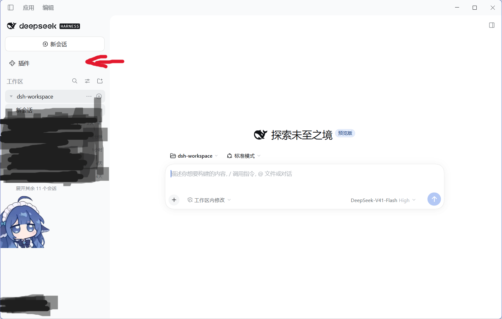
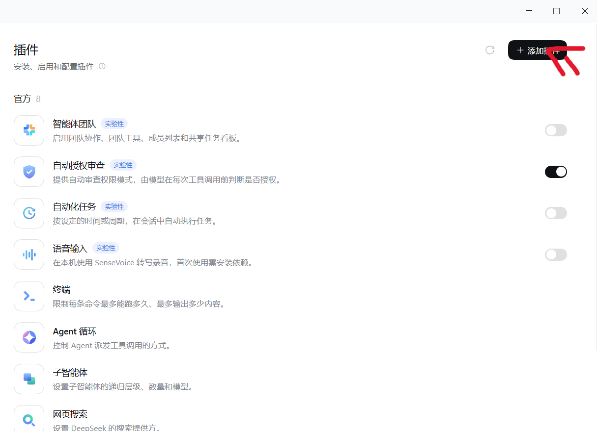
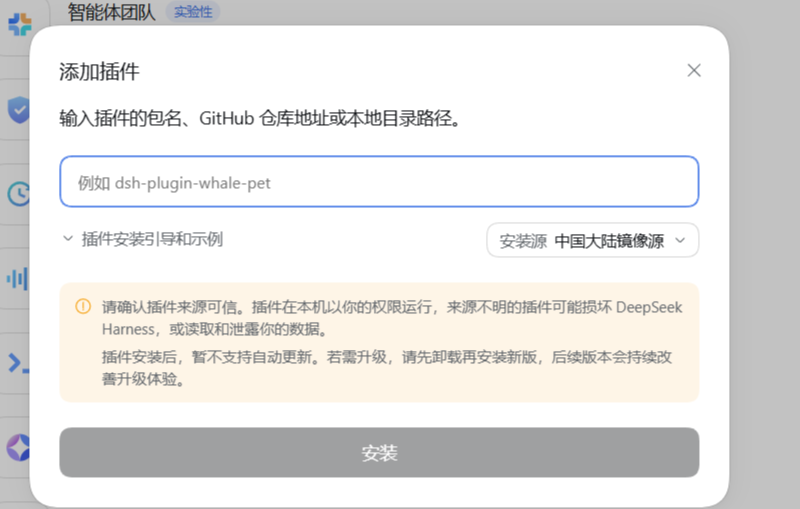

# dsh-time-prefix-desktop

在 dsh 中为每条用户消息自动添加当前时间前缀（`【2026/10/05，00:14】`，精确到分钟）——**不带自己的设置卡片**的桌面版。

## 和 dsh-time-prefix 的区别

| | dsh-time-prefix | dsh-time-prefix-desktop（本包） |
|---|---|---|
| 开关位置 | 设置页里的「时间前缀」卡片 | dsh 桌面版**插件管理页**里该插件自带的启用/停用开关 |
| Config schema | 有（`enabled`，带 `.volatile()`） | **没有** |
| 客户端半侧 | 有（`lib/client.js`，注册 `settings.section`） | **没有** |
| 运行时依赖 | `@deepseek-ai/schemastery` | **零依赖** |
| 适用 | 任意 profile，含 Web 版 | 桌面版；Web 版没有插件管理页 |

桌面版官方自带对所有第三方插件的启用/停用开关，它作用在 loader 行上（加/删 entry），而不是插件配置上。所以这个版本不需要、也不再提供自己的设置卡片——**两个包只装一个**，别同时装。

## 安装

### 第 1 步：下载并解压

在仓库页面点绿色的 **Code** 按钮 → **Download ZIP**，下载后解压。

本插件没有发布到 npm，所以下载 zip 就是标准安装方式。

解压出来是一个 `dsh-time-prefix-main` 目录（`main` 是仓库默认分支名），里面同时装着两个版本：

```
dsh-time-prefix-main/
  desktop/            ← 本插件在这层，装它
    package.json
    cordis.patch.yml
    lib/
    locale/
  web/                ← 带设置卡片的 web 版，本包不需要
    package.json
    cordis.patch.yml
    lib/
    locale/
```

**要填的安装路径是 `desktop` 这一层**，也就是包含 `package.json`、`cordis.patch.yml` 的那一层。

建议把它复制出来、改名成 `dsh-time-prefix-desktop` 再安装，路径短一些，以后也不容易被误删。在 PowerShell 里跑一行就够（把前面那段换成你的实际解压路径）：

```sh
xcopy /E /I "%USERPROFILE%\Downloads\dsh-time-prefix-main\desktop" "$env:USERPROFILE\Downloads\dsh-time-prefix-desktop"
```

这样插件就在 `C:\Users\<你的用户名>\Downloads\dsh-time-prefix-desktop`。**记下这个路径，下一步要用。**

### 第 2 步：用 dsh 官方插件安装器安装（推荐）

不用命令行。在 dsh 里点几下就能装好：

**① 点侧边栏的「插件」**



**② 点右上角的「+ 添加插件」**



**③ 在弹出的对话框里填入路径，点「安装」**



对话框那行小字写的是"输入插件的包名、GitHub 仓库地址或本地目录路径"——这里要填的是**你上一步那个目录的完整路径**，例如：

```
C:\Users\Lenovo\Downloads\dsh-time-prefix-desktop
```

把 `Lenovo` 换成你自己的 Windows 用户名。

> 如果在对话框里直接填仓库地址（`https://github.com/2522669008-zcy/dsh-time-prefix`）会失败：本仓库根目录没有 `package.json`，两个版本分别在 `desktop/` 和 `web/` 子目录里，仓库根不是一个可安装的包。**所以请填本地目录路径。**

装完后插件管理页会出现「时间前缀（桌面版）」，安装完成。

### 第 3 步：或者用命令行安装

如果你更习惯命令行，等效的做法是：

```sh
dsh plugin --profile desktop add C:\Users\Lenovo\Downloads\dsh-time-prefix-desktop
```

换成你自己的路径，两种办法：

- 把 `Lenovo` 换成你自己的 Windows 用户名（不确定就在文件资源管理器地址栏输入 `%USERPROFILE%` 回车看名字）。
- 或者用变量，在 PowerShell 里不管用户名是什么都能用：

```sh
dsh plugin --profile desktop add "$env:USERPROFILE\Downloads\dsh-time-prefix-desktop"
```

如果解压后你没把目录改名，路径结尾就是 `-main`：

```sh
dsh plugin --profile desktop add "$env:USERPROFILE\Downloads\dsh-time-prefix-main\desktop"
```

> 上面是 PowerShell 写法。cmd 里把 `"$env:USERPROFILE\..."` 换成 `"%USERPROFILE%\..."`。

**无论用哪种方式，装完之后插件都是从那个目录加载的，别挪走或删掉，否则插件失效。**

## 开关

装好后在 dsh 的插件管理页找到「时间前缀（桌面版）」，用它自带的开关启用或停用。停用即移除 loader 行，`agent/pre-step` 监听器随之被释放。

## 实现

只提供宿主侧行为：在 `agent/pre-step` 这个 waterfall 上，给本步要提交的用户消息文本前面拼上当前时间。

`agent/pre-step` 返回的消息就是 agent loop 会写进会话的 `user/message`，所以聊天记录、会话日志和模型看到的请求三者完全一致——不是只在浏览器里改写发送文本。

- **前缀里只有时间读数本身**，不带任何隐藏标记：写进 `text` 的东西都会被看到、也会发给模型。
- 读数是**直接拼在你写的文字前面**的，并且**后面跟一个换行**，所以整条消息读起来清爽（时间单独一行，你的话另起一行）：

  ```
  【2026/10/05，01:40】
  你的话
  ```

  消息里的图片不影响这一点——只要有文字，读数就贴在文字上。
- 只发图片、没有任何文字时，读数会作为一个独立的文本块放在图片前，且**不带尾随换行**（那种情况没有文字可拼，多一个换行只会平白空一行）。
- 已经带前缀的消息，旧前缀会被**剥掉换成当前时间**，而不是让开。这一条是为桌面版输入框持久化草稿准备的：草稿里带着上一次的前缀时，如果直接跳过，那个旧前缀（以及早期版本写在里面的隐形标记）就会被永久固化到之后每一条消息里。
- 只处理 `role === 'user'` 的消息；其他插件追加的上下文消息原样通过。
- 原消息对象不被修改（事件契约里它是不可变的）。

> **升级提示**：早期版本（以及 `dsh-time-prefix` 0.1）把隐形标记 `U+2063dsh-time-prefix` 写进了消息文本。如果你的输入框草稿里还残留着它，不用手动清理——发一次就会被剥掉。

## 许可

MIT
